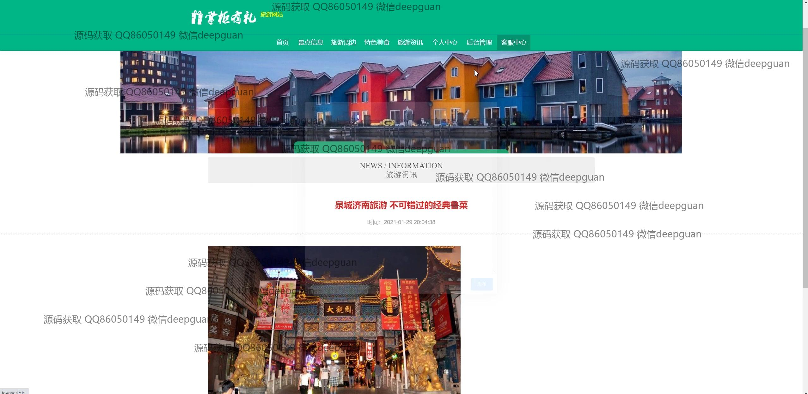

<h1 align="center">的旅游网站掌柜有礼vue</h1>

## 简介
掌柜有礼旅游网站：功能包括景点信息管理、用户管理、美食推荐、评论功能、票务订单管理和用户个人信息修改。界面设计简洁友好，提高用户体验与操作效率。    --计算机毕业设计源码；毕设源码；java毕业设计源码

## 联系方式

<h3 align="center">获取完整代码与数据库文件 + 微信：deepguan QQ: 86050149 QQ群: 783742310</h3>

<h3 align="center">可帮忙远程部署 包运行成功！提供远程部署、修改代码、设计文档指导、代码讲解等服务！</h3>

## 功能介绍（完整见运行截图）
管理员：负责旅游网站的整体管理，包括登录、注册和退出功能。需管理景点分类、景点信息、旅游资讯、用户、门票订单和特色美食等模块。提供新增、修改、删除和搜索功能，便于对景点信息、用户数据和订单详情的高效管理。通过后台可以查看评论、调整分类、编辑景点评价和美食信息，以确保网站内容的准确性和用户体验的优化。还可对用户提交的信息进行审核，并维护系统设置。

用户：可以在网站上进行登录、注册和退出操作。访问网站首页、查看轮播图和推荐信息，并浏览各景点详情和特色美食。丰富的查询功能方便用户获取景点及美食的详细信息，并通过在线购票、安全支付等功能进行订单处理。在个人中心模块，用户能够查看和编辑自己的个人信息以及收藏的内容。交互中支持发表评论，与其他用户进行互动，提升旅游体验。

游客：在不注册的情况下，游客可以浏览网站提供的公共信息，包括景点分类、美食介绍和旅游资讯。可以查看首页的图像轮播和推荐板块，获得旅游资源的初步了解。游客也可通过搜索功能寻找到感兴趣的景点和美食，但部分高级功能如在线购票、评论互动等需注册后方可使用。游客访问权限侧重于信息展示，确保对网站内容的广泛了解。

客服人员：保障用户在使用网站时获得良好的服务支持。负责解答用户在购票、浏览或提交信息过程中遇到的疑问。通过网站提供的联系方式（如电话、邮箱），协助用户解决技术问题和使用困惑。客服人员也可通过后台系统进行用户记录的查阅和问题跟踪，以提升整体服务质量和用户满意度。

## 运行截图

本代码来源于网络,仅供学习参考使用!

